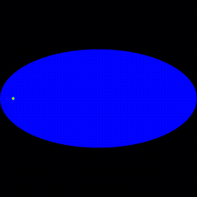

# Wave Simulation

Code for testing wave equation simulations and other PDEs using finite difference methods.

Based on the book [Finite difference methods for wave equations](https://hplgit.github.io/fdm-book/doc/pub/wave/pdf/wave-4print.pdf) by Langtangen and Linge.

`wave1d/` contains Python simulation of 1-D Wave Equation

`wave2d/` contains Python simulation of 2-D Wave Equation

`wave2d_c/` contains C simulation of 2-D Wave Equation and various examples

## Examples

Initial Plug

Square Obstacle

Elliptical Region

